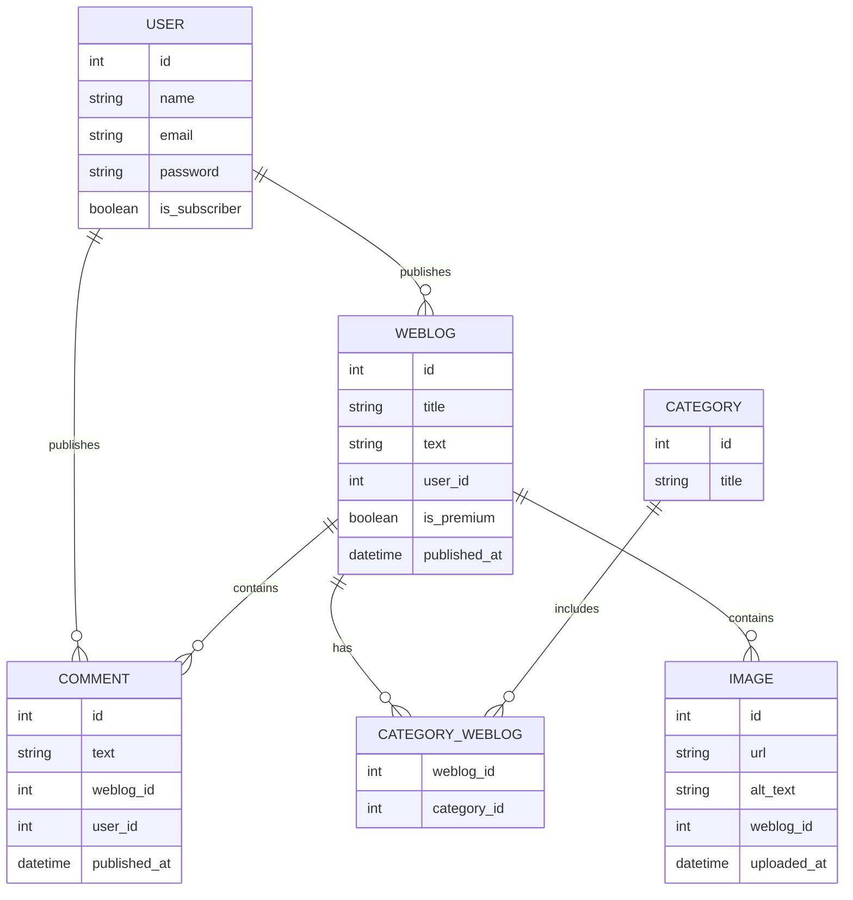

# database

```mermaid
erDiagram
    USER ||--o{ WEBLOG : publishes
    USER ||--o{ COMMENT : publishes
    WEBLOG ||--o{ COMMENT : contains
    WEBLOG ||--o{ CATEGORY_WEBLOG : has
    CATEGORY ||--o{ CATEGORY_WEBLOG : includes
    WEBLOG ||--o{ IMAGE : contains

    USER {
        int id
        string name
        string email
        string password
        boolean is_subscriber
    }
    
    CATEGORY {
        int id
        string title
    }
    
    WEBLOG {
        int id
        string title
        string text
        int user_id
        boolean is_premium
        datetime published_at
    }
    
    CATEGORY_WEBLOG {
        int weblog_id
        int category_id
    }
    
    COMMENT {
        int id
        string text
        int weblog_id
        int user_id
        datetime published_at
    }

    IMAGE {
        int id
        string url
        string alt_text
        int weblog_id
        datetime uploaded_at
    }
```
