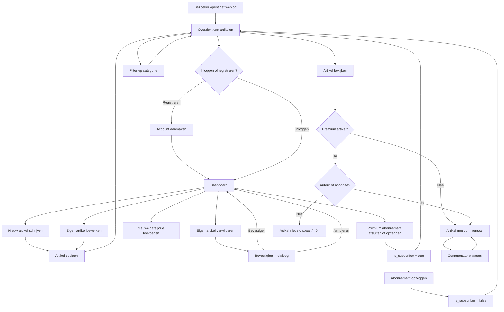

# Flowchart

```mermaid
flowchart TD
    A[Bezoeker opent het weblog] --> B[Overzicht van artikelen]
    B --> C{Inloggen of registreren?}

    C -- Registreren --> D[Account aanmaken]
    D --> E[Dashboard]
    C -- Inloggen --> E

    E --> F[Nieuw artikel schrijven]
    E --> G[Eigen artikel bewerken]
    E --> H[Eigen artikel verwijderen]
    E --> I[Nieuwe categorie toevoegen]
    E --> J[Premium abonnement afsluiten of opzeggen]

    F --> K[Artikel opslaan]
    G --> K
    K --> B

    H --> L[Bevestiging in dialoog]
    L -->|Bevestigen| E
    L -->|Annuleren| E

    J --> M[is_subscriber = true]
    M --> B

    M --> M2[Abonnement opzeggen]
    M2 --> M3[is_subscriber = false]
    M3 --> B

    B --> N[Filter op categorie]
    N --> B

    B --> O[Artikel bekijken]
    O --> P{Premium artikel?}

    P -- Nee --> Q[Artikel met commentaar]
    P -- Ja --> R{Auteur of abonnee?}
    R -- Nee --> S[Artikel niet zichtbaar / 404]
    R -- Ja --> Q

    Q --> T[Commentaar plaatsen]
    T --> Q
```
